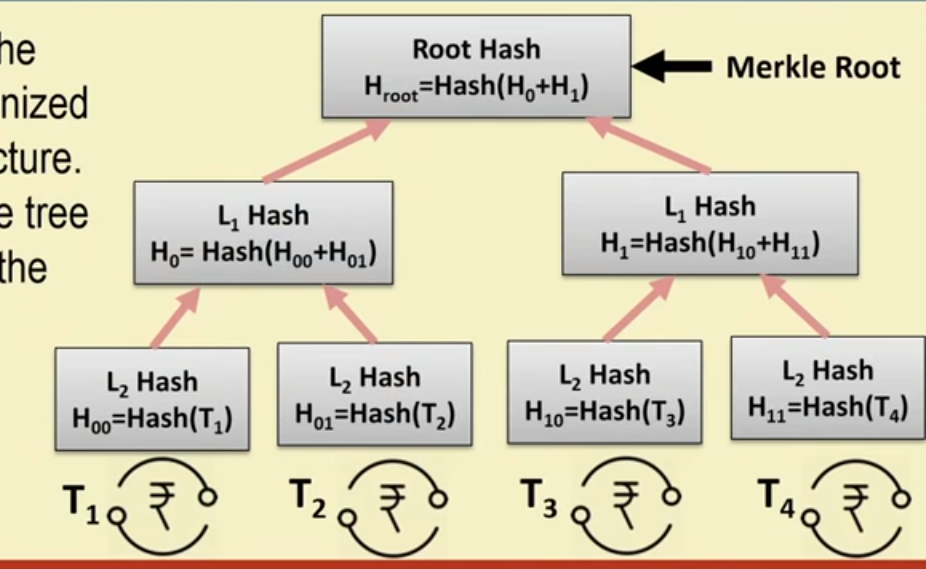

# Architecture

## Smart Contracts

- Coined by computer scientist and cryptographer Nick Szabo in 1996.
- Bitcoin can be pioneering technology to realize smart contracts.

## Contracts in a centralized platform

    Interesting idea -> Submit it to a crowd funding platform ->
    Multiple supporters to support with small funds ->
    Platform ensures that you get complete money if successful.

- Drawbacks
  - Need of trust on platform.
  - The product team expect to get paid.
  - The supporters expect money to go to project.
  - The middle man takes a large amount of fund.

## Contracts in a Smart Contracts

- The contract is written in code and is available to all persons.
- If the goal is reached then code automatically transfers money of if it fails moneys refunded.
- Advantages
  - Immutable
  - Distributed
  - Uses Blockchain

## Blocks in Blockchain

- Digitally signed and verified by peers.
- Cryptographically secured - Ensures that participants can only view information authorized to them.
- Block
  - is a container of data structure that contains a series of a transaction.
  - in Bitcoin can be of 1mb as stated by Satoshi Nakamoto in papers, but found as large as 8mb in March 2018, larger block can help in processing.

## Structure of a block

- Block header
- List of transactions

## Block header

- Metadata about a block
  - Previous block hash
  - Mining statistics
  - Merkle root tree
- Previous hash block
  - Every block inherits from previous block
- Mining - The mechanism to generate hash function.
  - Tamper proof
  - Bitcoin mining (Hk = Hk-1 || T || Nonce)
  - Nonce is the thing that miners have to find and it defines the complexity of the Hk.
  - The header contains the mining statistics, timestamp, nonce and its difficulty.
- Merkle root tree

  

  - The root is the verification of all the transactions.
  - The entire chain needs to be updated if you want to make any changes any where.

- The hashes in the block header of Bitcoin uses **Double SHA256** algorithm.
- Every peer in Blockchain maintains a local copy.
- Requirements
  - All replicas needs to be updated.
  - All replicas need to consistent exactly same.

## Distributed Consensus

- Different nodes seed the changes at nearly same time.
- All nodes need to agree on a regular basis.
- No single point of failure.
- Present in the times of failure.
- Open network scenario, permission less protocol.
- Challenge response based system - A challenge is made and each node has to solve it.

## Challenge response system

- The nodes or participants do not reveal id.
- The node that is able to solve the challenge first would get to dictate what is next.
- Design of a good challenge so that challenge is unique to a node.
- Proof of Work (PoW) ensures consensus over a permission less setting based of challenging response.

## The Economy

- Digital money.
- Published by Wei Dai in 1998.
- Cryptocurrency.
- Mining ensures control.
- Lot of computation power.
- Blockchain ensures currency is secure and tamper proof.
