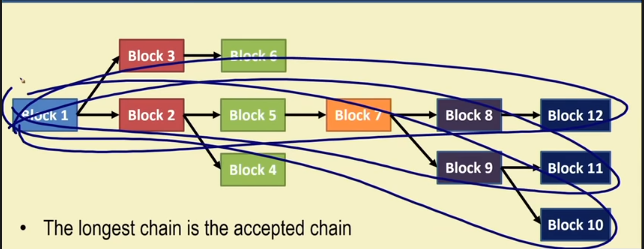
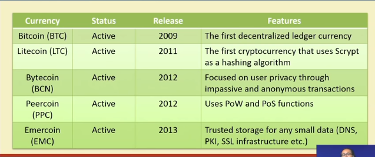

# Video 4 - Conceptualization of Blockchain

## Blockchain (at Permission-less Model) as a Tree

- Multiple miners try to mine a same block at same time.
- Each block can yield in more than one block and can follow along.
- And if another user comes in the block with the longest chain is accepted. And further blocks are added to the last block. And the left blocks are called orphaned blocks.
- And if the user has the choice, because of same length, it picks up randomly.

---

## The Cryptocurrency applications using Blockchain

- Bitcoin(2009) - The first decentralized ledger currency.
- Litecoin(2011) - The first cryptocurrency that uses Scrypt as hashing algorithm.
- Bytecoin(2012) - Focus on user privacy through impassive and anonymous transactions.
- Peercoin(2012) - Uses proof of work and state.
- Emercoin(2013) - Trusted storage for any small data (DNS, OPLI, SSL infrastructures etc.)

---

## The Permissioned (Private) Model - Blockchain 2.0

- Blockchain can be applied just beyond cryptocurrency.
- Security and distributed replicated ledgers can be applied to permissioned network settings.
- Most use cases involve only a small amount of participants.
- Can leverage the 30 years of literature to realize benefits like -
  - Strict security and privacy.
  - Greater transactional throughput based on the traditional notions of distributed consensus.
    - Raft consensus.
    - Paxos consensus.
    - Byzantine fault tolerance (BFT) algorithms.

## Applications

- Asset movement and tracking.
- Provenance tracking - Tracking the origin and movement of high value items across supply chain. Working -
  - When the item is created the digital token is issued.
  - Every time the physical item changes hands, digital token is moved in parallel.
  - The token is acting as a virtue of authenticity, which is far harder to steal.
