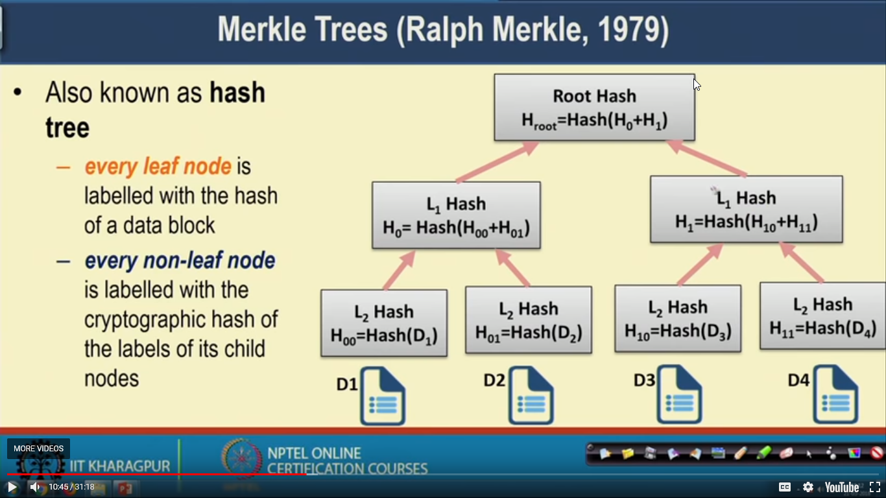

# History

## The Fundamentals

- **Hash function** - Map any size data to fixed size data and are one way. Example H(x) =  x % n.

## Cryptographically secured hash functions

- One way, means we can know H(x) by knowing x but not vice versa.
- If x1 and x2 are different then H(x1) and H(x2) should be different.
- **Avalanche effect** - Even a small change in input can result in a large amount of change in output.
- First used in 1991, by **Harber** and **Stornetta** for time stamping the digital documents
  - Whenever a client access a doc construct a bloc consisting of sequence number access the sequence Client ID, timestamp and a hash value form previous request.
- Also known as **hash tress or Merkle Trees -**
  - Every leaf node is labeled w/ hash value.
  - Every non leaf node is labelled w/ the cryptographic hash of child.
  - This can be used to secure a large number of accounts and can be known immediately if even a single document is changed.
    - Peer to peer n/w.
    - Bitcoin Implementation.

## What is Bitcoin ?

- Completely decentralized.
- Peer to peer.
- Permissionless.

> Bitcoin came up with a interesting solution to security in the open world of open nature of blockchain.

## The Bitcoin transaction cycle

- The wallet constructs the transactions and broadcasts to n/w.
- This is now validated and propagated to miners.
- The miners can include the time of transaction to in next block.
- The miners collect all the transaction from time.
- Miners construct new block and tries to connect it w/ existing block and tries to connect it w/ existing blockchain through cryptographic hash function.
- Once the mining is done, the block is included in blockchain.