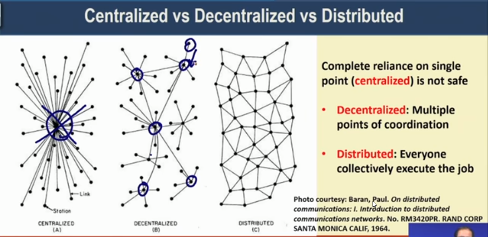

# Introduction to Blockchain

- Definition - A **decentralized computation and information sharing platform** that enables **multiple authoritative domains**, who **do not trust each other** to **cooperate, coordinate and collaborate** in a rational decision making process.

## In simple terms

- Blockchain is a decentralized database.
- Blockchain can be useful when multiple parties can come to agreement to cooperate and wanted to come on common platform to share info.
- Example - Let's say Alice and Bob are 2 persons and want to work on a document together, so they choose **MS Word**. First Bob writes and then gives the file to Alice, and then Alice writes and give the file to Bob. **Disadvantage** is that only one person can write on the file at time. Now they switch to **Google Docs**, so now they can write in the document at single time. A little bit better but now the problem arises that they a **single source of failure**.

## Architectures

- Centralized  - Prone to single point of failure for shutdown.
- Decentralized - There are multiple nodes of sources, if one node fails users can connect to another node.
- Distributed - Every node is acting as source as they work collectively. So no point of failure for shutdown.

> Problem we face right now that centralized architecture are not robust to failure, so we want to move away from them.

- Example- In previous case we wanted to have a copy in the system of Alice and Bob, and it is on the system network to ensure the synchronization between them.

## Very simplified look at Blockchain

- Every node maintains a local copy of the global data sheet.
- The system ensures consistency among the local copies.
  - The local copies at every node is identical
  - The local copy is updated based on the data of global data.
- We call this thing a public ledger, means the database available locally to everyone and in sync with global database.
- Different aspects need to be ensured
  - **Protocols for commitment** - confirm to commit every transaction in blockchain.
  - **Consensus** - Ensure local copies are updated and consistent.
  - **Privacy and Authenticity** - Data of various clients needs to be protected.

## Formal Definition

Blockchain is an **open**, **distributed ledger** that can record transaction b/w 2 parties efficiently and in a verifiable and permanent way.