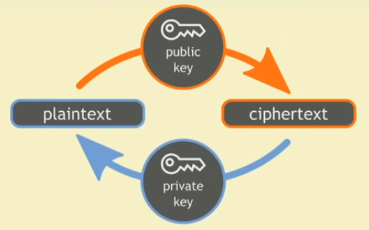
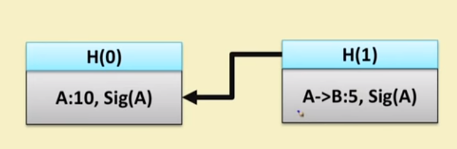

# Basic Crypto Primitives - 2

## Digital Signature

- A digital code which can be electronically verified and sent.
- The content of document is authenticated.
- The identity of the sender.
- Prevent *non-repudiation* - sender will not be able to deny.

## Purpose

- Sign can be done by original authority any other person can check it.
- Sign is linked with only one document, sign of one document cannot be transferred to another document.

## Public Key Cryptography

- Also known as asymmetrical cryptography or asymmetric key cryptography.
- **Key** - A parameter or value that can determine the output of cryptographic algorithm.
- **Encryption -** The key is used to convert a plain text in cypher text. `M' = E(M, Kpub)`
- **Decryption -** The key is used to convert the cypher text in plain text. `M = D(M', Kpri)`
- **Properties** (i.e. keys should truly unique)
  - Generated truly randomly.
  - The key should have sufficient length.
  - The key should contain sufficient entropy on a bit level. There should be not any pattern.
- **Two Keys are used.**
  - Private key - Only original authority has this key and used for decryption.
  - Public Key - Public to everyone, key used in encryption.

## Public Key Encryption - RSA

- The encryption key is public and decryption is private.

## Public & Private keys in RSA

- Find 3 very large, +ve integers e, d & n such that modules exponentiation for integers. (me)d === m(mod n).
- Even if you know e, n and m, it is very difficult to find d.
- We can change order in (me)d === (md)e === m(mod n).
- This helps us generates 2 keys (e, n) public, (d, n) private.

## RSA Key generation and distribution.

- Choose two distinct prime integers p and q, should be truly random.
- Find `n = pq`, n is used as modules, length of n is called key length.
- Compute `phi(n) = (q-1)(p-1)` - Euler totient function.
- Choose and integer `e` such that `1 < e < phi(n)` and `gcd(e, phi(n)) = 1 e and phi(n) are co-prime.`
- Determine d = e-1(mod phi(n)), d is the modular multiplicative inverse e(mod phi(n)). [ Note d.e = mod phi(n) ]

## RSA Key Encryption & Decryption

- m is integer representation of M. C === me(mod n).
- Encryption w/ public key (e, n).
- Decryption w/ private key (d, n). m = Cd(mod n) === (m d)e) mod n.

## Digital Sign in Blockchain

- Used to validate the origin.
- Bitcoin uses ECDSA.
  - Based on elliptic curve cryptography.
  - Supports good randomness.

## A Cryptocurrency using hash chain and digital sign.

